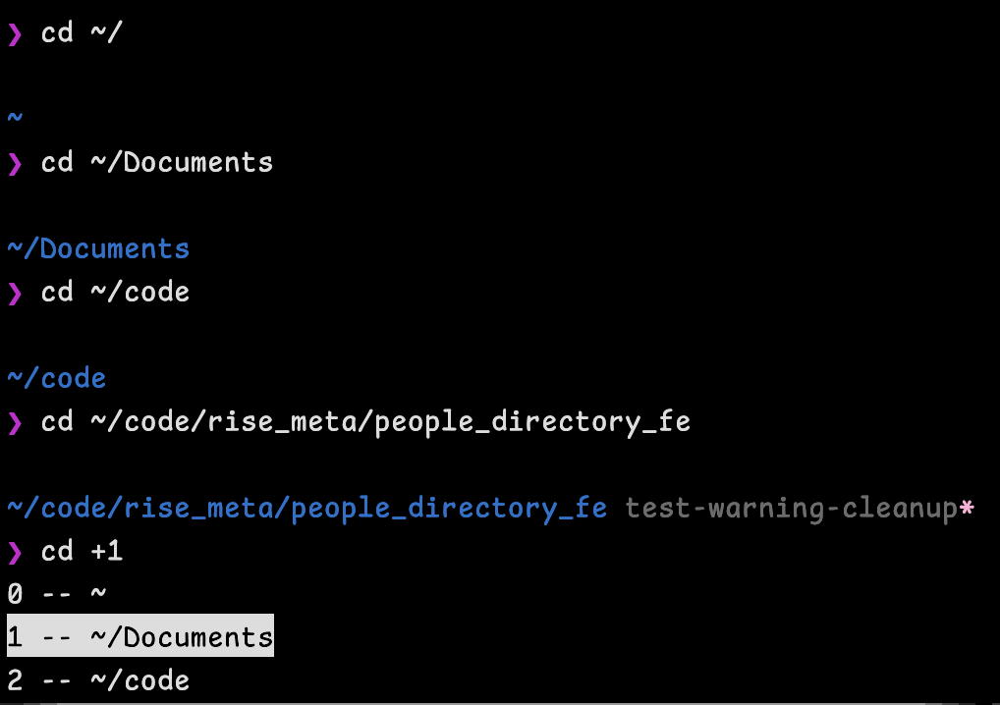
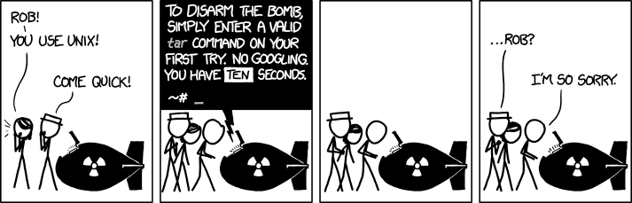

<!-- font_size: 4 -->
The Plan
===
<!-- speaker_note: "A smattering of topics across **three** categories, presented in approximately 
decreasing likelihood that 
you'll remember them:" -->

<!-- speaker_note: 3 points, joke -->

<!-- font_size: 2 -->
<!-- speaker_note: Fingers, quick wins to type less/type smartly -->
<!-- pause -->
- **Fingers.**
<!-- speaker_note: Brain, good things to have in the back of your head. -->
<!-- pause -->
- **Brain.** 
<!-- speaker_note: Joke, software recs -->
<!-- pause -->
- …Software recommendations.

<!-- end_slide -->

Four Notes
===
<!-- speaker_note: "Shells can be different but my audience uses zsh." -->
<!-- pause -->
# Shells aren't all the same
And everything I talk about here is `zsh`.

Okay? Okay.
<!-- speaker_note: "Sources: This presentation is also just a markdown file, will be in Confluence/Drive/Slack." -->
<!-- pause -->

# Sources & Reference Materials

Are available!

<!-- speaker_note: "No Scripting: We should probably use other languages to write scripts anyway, Shell is horrible." -->
<!-- pause -->
# No Scripting!

Please don't write more shell scripts in `$CURRENT_YEAR`.

<!-- speaker_note: "No Editor Wars: But a short section on software at the end." -->
<!-- pause -->
# No Editor Wars!
Although for the record, I am a `vim` partisan. Okay...
<!-- speaker_note: "let's go text!" -->

<!-- pause -->

<!-- font_size: 3 -->
Let's go!
<!-- end_slide -->

<!-- font_size: 7 -->
**Fingers**
===
<!-- speaker_note: "organized least-to-most keystrokes" -->

<!-- end_slide -->
Fingers: Want to Save 3 Keystrokes?
===
<!-- speaker_note: "Stop using `cat`, it's often pointless:" -->
<!-- pause -->

```zsh {1}
$ cat myscript.py
#!/usr/bin/env python3
import time

for i in range(40): 
    print(f"{i}: {1000 - i}", flush=True)
    time.sleep(0.2)
```

<!-- pause -->

An input redirection without a command in `zsh` executes `$READNULLCMD`, which 
you probably have set to a pager by default.

```zsh {1-3}
$ echo $READNULLCMD
more
$ <myscript.py 
#!/usr/bin/env python3
import time

for i in range(40): 
    print(f"{i}: {1000 - i}", flush=True)
    time.sleep(0.2)
(END)
```
<!-- speaker_note: "Next: Input Redirection exists" -->
<!-- end_slide -->

Fingers: Input Redirection Exists!
===
Also, hey, input redirection exists:

```zsh
# Copy a file into the STDIN of any process.
$ <myscript.py pbcopy
```

<!-- end_slide -->
<!-- column_layout: [1,3,1] -->

<!-- column: 1 -->
The Magic $_ Parameter (1/2)
===

<!-- speaker_note: "Katy, remember ^E for execute, ^R reload" -->
<!-- speaker_note: "Something I use all the time, check this out:" -->

<!-- pause -->

What does this do? 

```zsh +exec
echo a "warm hello"
echo $_ world
```

<!-- speaker_note: "(detail about redirects)" -->
<!-- pause -->

But note the behaviour on redirects:

```zsh +exec
echo "hello, world!" > /tmp/myfile.txt
echo $_
```

You can also use `csh`-style history to get other words from
the command, or previous commands:

```zsh
$ mycommand 0 1
$ echo "hello," beautiful "world!"
$ echo !:2
beautiful
$ echo !-3:$ # last argument
1
```

(...But the demo doesn't work in this slideshow software)

Also ZLE exists but let's not get bogged down in details.

<!-- speaker_note: "Next: applications" -->

<!-- end_slide -->
The Magic $_ Parameter - Applications: (2/2)
===
<!-- speaker_note: "Next: applications" -->
<!-- pause -->

```zsh
mkdir mydirectory && cd $_
```

```zsh
touch cool_script_i_found_online.xsh && pbpaste > $_ && chmod +x $_ && ./$_
```

<!-- speaker_note: "Next Section: my actual history file, use it all the time, proof of the pudding is in the eating" -->

<!-- pause -->
And, of course, from my actual history file:

```zsh
$ history | grep -B1 \$_
 7334  cp .devcontainer/.env.example .devcontainer/.env
 7335  vim $_
--
 7460  which hyperfine
 7461  brew install $_
--
 7602  git restore --staged testfile
 7603  git restore $_
--
 7770  vim ~/.oh-my-zsh/custom/aliases.katy.zsh
 7771  source $_
--
 7780  vim ~/code/scratch/another_idea_for_ci.md
 7781  echo $_ | pbcopy
--
 7995  vim src/apps/common/components/EmployeeDropdownWithSearch/__tests__/EmployeeDropdownWithSearch.test.tsx
 7996  npm test $_
 7997  npm test  -- $_
```

<!-- speaker_note: "Next: While we're on the topic, let's talk history, fc, you're probably been using fc but don't know it" -->

<!-- end_slide -->

Fingers: Let's Talk History
===
<!-- speaker_note: "Next: While we're on the topic, let's talk history."  -->

<!-- speaker_note: "there's a command called fc, you're probably been using fc but don't know it" -->
<!-- speaker_note: "Is an alias. " -->
<!-- pause -->

<!-- speaker_note: "what is fc you might ask, well it stands for" -->
- `history` is usually just an alias for `fc -l`
<!-- pause -->
- `fc` stands for `f`ix `c`ommand!

```zsh
$ echo hi
hi
$ fc -l | tail -1
11195  echo hi
```
<!-- speaker_note: "As the name implies, it can fix your typos!" -->
<!-- speaker_note: "Sequence: error, fix, $EDITOR." -->
<!-- pause -->
- `fc` and its friend `r` can also fix your typos sometimes
```zsh
$ bk build create -p people-directory-fe-set -b main -c e6826350b618f904d3815f66536f9ce95db0d747
Booo, error!
```
<!-- pause -->
```zsh
$ fc -s set=test main=master
bk build create -p people-directory-fe-test -b master -c e6826350b618f904d3815f66536f9ce95db0d747
$
# Note that `r` does the same thing as `fc -s`
# There are other history manipulating commands, see `man zshbuiltins`
```
<!-- pause -->
- `fc` called plainly just opens up `$EDITOR` to let you fix your previous command. It is executed on save.

<!-- speaker_note: "Next: Directory stack!" -->

<!-- end_slide -->
Fingers: The Directory Stack
===
<!-- speaker_note: "Yada yada, the shell can keep a session history of directories in a directory stack..." -->
<!-- pause -->

```zsh
$ pushd ~/code/myproject   # saves cwd, then cd
$ dirs                     # displays the stack
$ popd                     # pops off the stack
$ pushd                    # with no argument - swap
```

<!-- speaker_note: "Next: zsh default" -->
<!-- pause -->

By default, `zsh` puts all of your `cd` calls onto the directory stack. (Or set option `autopushd` if it doesn't.)

<!-- speaker_note: "Next: cd +/- args" -->
<!-- pause -->

Also, `cd` can navigate the directory stack too, try tab-completing this:
```zsh
cd +
```
<!-- speaker_note: "tabcomplete picture" -->
<!-- pause -->

<!-- speaker_note: "aside on tab completion?" -->

<!-- speaker_note: "Next: Brain section!" -->
<!-- end_slide -->


<!-- font_size: 7 -->
**Brain**
===
<!-- speaker_note: "Helpful things that you should know about, keep in your back pocket." -->
<!-- end_slide -->

Brain: Pasteboard Copy/Paste (macOS-only) [1/2]
===
<!-- speaker_note: "I've shown these a few times in previous slides, let's talk copy/paste" -->
<!-- speaker_note: "Next section: summarize manpage" -->
<!-- pause -->

I use these a lot. From the manpage:
<!-- speaker_note: "btw: read manpages!" -->

```txt {2-3, 11-12}
DESCRIPTION
       pbcopy takes the standard input and places it in the
       specified pasteboard. If no pasteboard is specified,
       the general pasteboard will be used by default.  The
       input is placed in the pasteboard as plain text data
       unless it begins with the Encapsulated PostScript
       (EPS) file header or the Rich Text Format (RTF) file
       header, in which case it is placed in the pasteboard
       as one of those data types.

       pbpaste removes the data from the pasteboard and
       writes it to the standard output.  It normally looks
       first for plain text data in the pasteboard and
       writes that to the standard output; if no plain text
       data is in the pasteboard it looks for Encapsulated
       PostScript; if no EPS is present it looks for Rich
       Text.  If none of those types is present in the
       pasteboard, pbpaste produces no output.
```
<!-- speaker_note: "Next slide, examples: a file into clipboard" -->
<!-- end_slide -->
Brain: `pbcopy`/`pbpaste` (macOS-only) [2/2]
===
Examples: 

```zsh
$ <"~/myfile.txt" pbcopy
```
<!-- speaker_note: "Examples: a file into clipboard" -->

<!-- speaker_note: "Next: commitsha alias example" -->
<!-- speaker_note: "demo keys ^E/^R" -->
<!-- speaker_note: "do the demo, remember to show clipboard w/ spotlight" -->
<!-- pause -->

```zsh +exec
alias commitsha="git rev-parse --short HEAD | tr -d '\n' | pbcopy"
cd ~/code/rise_meta/people_directory_fe/ && commitsha
pbpaste
```

<!-- speaker_note: "Next: open command demo" -->
<!-- end_slide -->

Brain: The `open` utility (macOS-only)
===
<!-- speaker_note: "Next: open command demo" -->
<!-- pause -->

```zsh +exec
open ~/code/scratch/colours/swatches/*.png
```

<!-- speaker_note: "Next: cheatsheet summary, -R etc flags" -->
<!-- pause -->

I also have cheatsheets for some of these:

```zsh +exec
cheat open
```


<!-- speaker_note: "Next: job control, if we have time?" -->
<!-- end_slide -->

Brain: Job Control
===

(live demo?)

<!-- speaker_note: "show: jobs/bg/fg/kill/claude demo/&/wait" -->
<!-- end_slide -->

<!-- font_size: 7 -->
**Software Recommendations**
===
<!-- speaker_note: "Bunch of cool tools!" -->
<!-- end_slide --> 

**Software Recommendations: `cheat`**
===
<!-- speaker_note: "Do you remember how to use tar?" -->
<!-- speaker_note: "next: xkcd" -->
<!-- pause -->

<!-- speaker_note: "it doesn't have to be this way." -->

<!-- pause -->
```zsh +exec
cheat tar
```

<!-- speaker_note: "^R then --- also, make your own!!!" -->
<!-- speaker_note: "Next: I have a growing repository of cheatsheets" -->

<!-- end_slide --> 
**Software Recommendations: `cheat`**
===
[My cheatsheets:](https://github.com/nok-ko/cheatsheets)

<!-- speaker_note: "Next: mise" -->
<!-- end_slide --> 

**Software Recommendations: `mise`**
===

<!-- speaker_note: "nvm replacement, other tools too, boring to demo" -->
<!-- pause -->
Claims to replace asdf/nvm/rvm/whatever -- I think it succeeds.

(Boring to demo, though)
<!-- speaker_note: "Next: lazygit" -->

<!-- end_slide --> 

**Software Recommendations: `lazygit`**
===

The best way to interactively rebase!

<!-- end_slide --> 
**Software Recommendations: `fd`**
===

<!-- speaker_note: "2 pauses, find vs fd" -->
<!-- pause -->

Has this ever been you?

```zsh
$ find -name myscript ~/
find: illegal option -- n
usage: find [-H | -L | -P] [-EXdsx] [-f path] path ... [expression]
       find [-H | -L | -P] [-EXdsx] -f path [path ...] [expression]
$ find ~/ -name myscript
^C
$ find ~/ -name \*myscript\*
/Users/katy.petrova/.local/state/nvim/undo/%Users%katy.petrova%myscript.py
^C
$ find ~/ -depth 1 -name \*myscript\*
^C
$ find ~/ -maxdepth1 -name \*myscript\*
find: -maxdepth1: unknown primary or operator
$ find ~/ -maxdepth 1 -name \*myscript\*
/Users/katy.petrova/myscript.py
```

<!-- pause -->

Stop it. Treat yourself to an easier experience.

```zsh
$ fd myscript ~/
/Users/katy.petrova/myscript.py
```

Less-frustrating `find`!

<!-- end_slide --> 
**Software Recommendations: `hyperfine`**
===

<!-- speaker_note: "If demoing, copy/paste as presenterm does weird niceness things" -->
Better benchmarks than `time`!

```zsh
cd ~/code/rise_meta/people_directory_fe/ && hyperfine --warmup 1 --runs 3 "mise exec -- npm test"
```

<!-- end_slide --> 
**Conclusions**
===

- Read manpages, stay curious, get faster
- I like learning this stuff because I like the feeling of using the computer well
- :)
